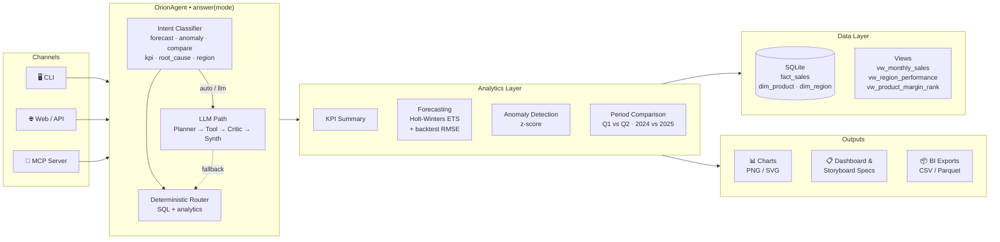

# OrionPulse Data Agent

Sales analytics agent built on SQLite + FastAPI. Deterministic-first with optional LLM orchestration — every question has a fast, predictable answer even without an API key.

---

## Architecture



---

## Quickstart

```bash
# 1. Install
python -m venv .venv && source .venv/bin/activate
pip install -r requirements.txt

# 2. Seed database
python data/init_db.py

# 3. Run
python mcp_server/server.py                                        # MCP
python -m uvicorn src.orion_sales_agent.webapp:app --reload        # Web UI → http://localhost:8000
```

---

## CLI

```bash
# Basic query (deterministic, no LLM needed)
python scripts/ask_agent.py --question "forecast next 3 months revenue" --format json

# Auto mode — uses LLM if configured, falls back gracefully
python scripts/ask_agent.py --question "why did margin drop in APAC" --mode auto

# Period comparison (new)
python scripts/ask_agent.py --question "compare Q1 vs Q2 revenue and margin"

# With charts
python scripts/ask_agent.py --question "show performance" --with-charts --format json

# Trace LLM planner steps live (prints to stderr)
python scripts/ask_agent.py --question "..." --mode llm --trace

# Reset conversation memory
python scripts/ask_agent.py --reset-memory
```

---

## LLM (optional)

The agent works fully without an LLM. To enable richer multi-step reasoning:

```bash
# OpenAI
ORION_LLM_API_KEY=sk-...
ORION_LLM_BASE_URL=https://api.openai.com/v1
ORION_LLM_MODEL=gpt-4o-mini

# Ollama (free, local)
ORION_LLM_BASE_URL=http://localhost:11434/v1
ORION_LLM_MODEL=llama3.2
ORION_LLM_API_KEY=ollama
```

`ORION_WEB_DEFAULT_MODE=auto` — tries LLM, falls back to deterministic with `fallback_reason` in the response.

---

## API response shape

```json
{
  "status": "ok",
  "trace_id": "orion-a3f9c1...",
  "timestamp": "2026-04-05T10:00:00Z",
  "warnings": [],
  "execution_mode": "deterministic | llm_orchestrated | fallback_rule_based",
  "fallback_reason": null,
  "data": { ... }
}
```

Endpoints: `/chat` `/kpi` `/forecast` `/ask` `/ask_with_visuals` `/ask_with_analytics_exports` (+ `/v1/` aliases)
Admin: `DELETE /memory` — clears conversation memory

---

## Auth

Three profiles via `ORION_AUTH_PROFILE`: `DEV_OPEN` · `DEV_GUARDED` · `PROD_STRICT`
Pass tokens as `X-Orion-Token: <value>`. Startup hard-fails if tokens are missing in non-dev environments.

---

## Key modules

| Module | Purpose |
|--------|---------|
| `agent.py` | Orchestration — intent routing, LLM loop, memory, fallback |
| `analytics.py` | KPI summary, anomaly detection |
| `forecasting.py` | Holt-Winters ETS, holdout backtest, model selection |
| `rate_limiter.py` | Token-bucket rate limiter (stdlib only) |
| `sql_policy.py` | 3-layer SQL safety: statement · keyword · SQLite EXPLAIN |
| `webapp.py` | FastAPI routes, auth, response envelope |
| `mcp_server/server.py` | 11 MCP tools over the same analytics layer |
| `skills/*.md` | Business context loaded into LLM prompts at startup |

---

## Demo notebook

`notebooks/orionpulse_demo.ipynb` — end-to-end walkthrough: seed → KPI → forecast → anomaly → period comparison → LLM trace → memory reset → spec generation.

---

## Validation

```bash
python scripts/preflight.py
pytest                        # 124 tests
```

Full docs in `docs/` · Security policy in `SECURITY.md`
